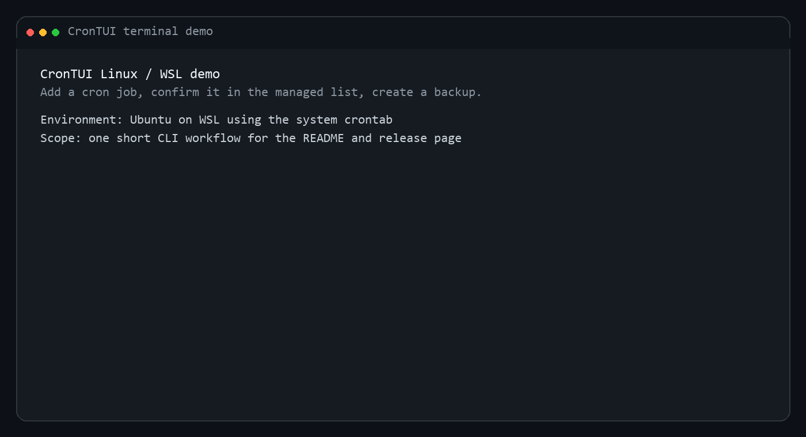
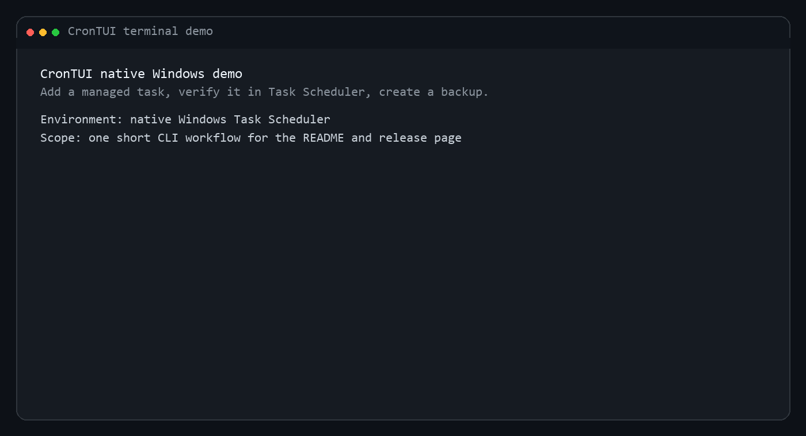

# CronTUI

A terminal scheduler that makes cron and native Windows task management feel like a real interface instead of a string-editing puzzle.

Live page: [merup.me/crontui](https://merup.me/crontui/)

CronTUI combines a polished Bubble Tea interface with CLI parity, live validation, next-run previews, backups, and an honest split between Unix cron semantics and native Windows Task Scheduler behavior.


## Demo



Short Linux / WSL CLI flow: add a cron job, confirm it in the managed list, and create a backup.

## Features

- **Interactive TUI** — browse, add, edit, delete, and toggle cron jobs visually
- **Live validation** — cron expressions are validated in real-time as you type
- **Next-run preview** — see upcoming execution times before saving
- **Stable managed IDs** — job IDs stay stable across deletes and rewrites
- **Schedule presets** — quick-pick common schedules (hourly, daily, weekly, etc.)
- **Search & filter** — find jobs by command or filter by enabled/disabled
- **Backup & restore** — automatic backups before every write, with restore support
- **CLI mode** — every operation is also available as a non-interactive subcommand
- **Export / Import** — export jobs as JSON or crontab format, import from JSON

## Platform Support

CronTUI manages real schedules on:

- Linux via the system `crontab`
- macOS via the system `crontab`
- WSL2 distributions such as Ubuntu via the distro's `crontab`
- Native Windows via Windows Task Scheduler for CronTUI-managed tasks

### Native Windows Behavior

On native Windows, CronTUI manages only the tasks it owns inside a dedicated Task Scheduler folder:

- default path: `\CronTUI\`
- configurable via `windows_task_path` or `CRONTUI_WINDOWS_TASK_PATH`
- stable IDs are stored in task names like `job-42`
- backups are JSON manifests of the logical CronTUI job set, not raw Task Scheduler XML dumps

CronTUI does not attempt to import or edit arbitrary existing Task Scheduler jobs outside that folder.

### Native Windows Demo



Short native Windows CLI flow: add a managed task, confirm it in Task Scheduler, and create a backup.

### Best Way To Use On Windows

Choose the environment based on the semantics you need:

- Use native Windows when you want CronTUI to manage Task Scheduler jobs under `\CronTUI\`.
- Use WSL2 when you want full Unix cron behavior, especially cron-only semantics such as `@reboot`.

For WSL2:

```powershell
wsl --install -d Ubuntu
wsl
sudo apt update
sudo apt install -y cron golang
sudo service cron start
go install github.com/meru143/crontui@latest
~/go/bin/crontui
```

Jobs created this way run inside the WSL/Linux environment, not in native Windows Task Scheduler.

## Installation

### Stable release (recommended)

```bash
go install github.com/meru143/crontui@latest
```

`@latest` installs the newest semver tag, not necessarily the newest commit on `master`.

### Native Windows install with Go

Use this path when you want CronTUI to manage native Windows Task Scheduler jobs instead of WSL cron jobs.

Requirements:

- Windows with the built-in `ScheduledTasks` PowerShell cmdlets available
- Go installed locally
- a normal interactive user account; admin is not required for standard time-based tasks

Install and run without relying on `PATH`:

```powershell
go install github.com/meru143/crontui@latest
$gobin = go env GOBIN
if (-not $gobin) { $gobin = Join-Path (go env GOPATH) "bin" }
& (Join-Path $gobin "crontui.exe") version
& (Join-Path $gobin "crontui.exe")
```

If you prefer calling `crontui` directly, add that same `bin` directory to your user `PATH`.

### Native Windows install from a release binary

1. Download the latest Windows `.zip` asset from [GitHub Releases](https://github.com/meru143/crontui/releases).
2. Extract `crontui.exe` to a directory you control, such as `%USERPROFILE%\\bin\\crontui`.
3. Run it directly or add that directory to `PATH`.

Example:

```powershell
cd $HOME\bin\crontui
.\crontui.exe version
.\crontui.exe
```

### Latest `master` commit

```bash
go install github.com/meru143/crontui@master
```

Use this when you want the newest unreleased changes before the next tagged release.

### Prebuilt binaries

Download the latest release artifacts from the GitHub Releases page:

- [Releases](https://github.com/meru143/crontui/releases)

### Build locally

```bash
git clone https://github.com/meru143/crontui.git
cd crontui
make build
```

### Native Windows quick check

After installing on native Windows, verify that CronTUI can create and see managed Task Scheduler jobs:

```powershell
crontui add "0 9 * * 1-5" "Write-Output hello-from-crontui" --desc "weekday hello"
crontui list --json
Get-ScheduledTask -TaskPath '\CronTUI\'
```

Expected result:

- `crontui list --json` shows the managed job
- `Get-ScheduledTask` shows a task such as `job-1` under `\CronTUI\`

If you changed `windows_task_path`, replace `\CronTUI\` with your configured path.

## Usage

### Interactive TUI

```bash
crontui
```

### CLI subcommands

```bash
crontui list                          # List all cron jobs
crontui list --json                   # List as JSON
crontui add "*/5 * * * *" "/usr/bin/backup.sh" --desc "Backup every 5 min"
crontui delete 3                      # Delete job #3
crontui enable 2                      # Enable job #2
crontui disable 2                     # Disable job #2
crontui validate "0 */2 * * *"        # Validate a cron expression
crontui preview "0 9 * * 1-5" 5       # Show next 5 runs
crontui backup                        # Create a backup
crontui restore <filename>            # Restore from backup
crontui export --format=json          # Export as JSON (default)
crontui export --format=crontab       # Export as raw crontab
crontui import jobs.json              # Import jobs from JSON
crontui version                       # Show version
crontui help                          # Show help
```

## Behavior Notes

- CronTUI preserves non-job crontab content such as environment variable lines and unrelated comments.
- Managed jobs get stable internal IDs so `delete`, `enable`, `disable`, and `run` keep pointing at the same jobs after other mutations.
- Native Windows manages only CronTUI-owned tasks under the configured Task Scheduler path; Unix and WSL continue to manage the user's real crontab.
- Windows accepts only the cron subset that maps exactly to Task Scheduler. Unsupported expressions fail before save or import instead of being approximated silently.
- `@reboot` is supported on Unix and WSL cron backends, but it is rejected on native Windows because non-admin Task Scheduler startup triggers are not reliably available per user.
- Every mutating write creates a backup first. Restoring a backup also creates a pre-restore backup of the current managed job set.
- `runnow` / `run` executes the saved command immediately outside the normal schedule:
  - Unix / WSL: through `sh -c`
  - native Windows: through `powershell.exe -NoProfile -NonInteractive -Command`
- Disabled jobs cannot be executed through `runnow` / `run`.

## Common Cron Examples

```bash
*/5 * * * *          # every 5 minutes
0 * * * *            # every hour
0 9 * * 1-5          # 9:00 on weekdays
30 2 * * *           # 02:30 every day
0 0 1 * *            # first day of every month
0 0 1 1 *            # every January 1st
@hourly              # hourly shortcut
@daily               # daily shortcut
@reboot              # run once on reboot
```

## Keyboard Shortcuts

### List View

| Key | Action |
|-----|--------|
| `↑` / `k` | Move up |
| `↓` / `j` | Move down |
| `Home` / `g` | Jump to first job |
| `End` / `G` | Jump to last job |
| `a` | Add new job |
| `e` / `Enter` | Edit selected job |
| `d` | Delete selected job |
| `t` | Toggle enabled/disabled |
| `/` | Search jobs |
| `x` | Run selected job now |
| `f` | Cycle filter (all → enabled → disabled) |
| `b` | Open backup list |
| `?` | Open help |
| `R` | Remove all managed jobs |
| `r` | Refresh job list |
| `q` | Quit |

### Form View (Add/Edit)

| Key | Action |
|-----|--------|
| `Tab` / `Shift+Tab` | Move between fields |
| `Alt+1`–`Alt+6` | Apply schedule preset |
| `Ctrl+S` | Save job |
| `?` | Open help |
| `Esc` | Cancel and return to list |

### Backup View

| Key | Action |
|-----|--------|
| `↑` / `↓` | Navigate backups |
| `Enter` | Restore selected backup |
| `?` | Open help |
| `Esc` | Return to list |

### Help View

| Key | Action |
|-----|--------|
| `Esc` / `Enter` / `q` / `?` | Return to previous screen |

## Project Structure

```
crontui/
├── main.go                  # Entry point: CLI dispatch or TUI launch
├── internal/
│   ├── cli/cli.go           # CLI subcommand handler
│   ├── config/config.go     # Defaults + file/env config loading
│   ├── cron/
│   │   ├── validator.go     # Cron expression validation (robfig/cron)
│   │   └── preview.go       # Next-run calculation & formatting
│   ├── crontab/
│   │   ├── reader.go        # Read system crontab
│   │   ├── writer.go        # Write system crontab
│   │   ├── parser.go        # Parse crontab lines into CronJob structs
│   │   └── backup.go        # Backup create/restore/prune/list
│   ├── scheduler/           # Unix crontab and Windows Task Scheduler backends
│   ├── model/
│   │   ├── model.go         # Bubble Tea model (Init/Update/View)
│   │   ├── list.go          # List view rendering & key handling
│   │   ├── form.go          # Add/edit form view
│   │   ├── backup.go        # Backup list view
│   │   ├── help.go          # TUI help screen
│   │   ├── run_remove.go    # Run output & remove-all confirmation
│   │   └── helpers.go       # Utility functions
│   └── styles/styles.go     # Lip Gloss styles & color palette
└── pkg/types/cronjob.go     # CronJob struct
```

## Configuration

CronTUI starts from built-in defaults, then merges:

1. `~/.config/crontui/config.json` by default
2. `CRONTUI_CONFIG=/path/to/config.json` if set
3. `CRONTUI_...` environment variables as the final override

Supported config keys:

```json
{
  "max_backups": 10,
  "show_next_runs": 5,
  "backup_dir": "/home/user/.config/crontui/backups",
  "log_level": "info",
  "date_format": "2006-01-02 15:04:05",
  "windows_task_path": "\\\\CronTUI\\\\"
}
```

Supported environment variables:

```bash
CRONTUI_CONFIG
CRONTUI_MAX_BACKUPS
CRONTUI_SHOW_NEXT_RUNS
CRONTUI_BACKUP_DIR
CRONTUI_LOG_LEVEL
CRONTUI_DATE_FORMAT
CRONTUI_WINDOWS_TASK_PATH
```

## Release Process

For maintainers, `@latest` moves only when a new semver tag is created.

1. Push the verified release commit to `master`.
2. Open GitHub Actions and run the `Manual Release Tag` workflow.
3. Choose `patch`, `minor`, or `major`.
4. The workflow creates and pushes the next `v*` tag from `master`.
5. The tag triggers the `Release` workflow, which builds and publishes GitHub release artifacts and uploads the committed demo GIFs from `media/demo/`.

The manual tag workflow is defined in [.github/workflows/manual-release.yml](C:/Users/merup/Downloads/crontui/.github/workflows/manual-release.yml). The tag-driven release workflow is [.github/workflows/release.yml](C:/Users/merup/Downloads/crontui/.github/workflows/release.yml). For a short maintainer checklist, see [RELEASING.md](C:/Users/merup/Downloads/crontui/RELEASING.md).

## Troubleshooting

### Windows says a schedule is valid cron but unsupported

Native Windows only accepts the schedule subset that maps exactly to Task Scheduler. Examples that are intentionally rejected include:

- `@reboot`
- mixed day-of-month and day-of-week expressions such as `0 9 1 * 1`
- minute intervals that Task Scheduler cannot represent exactly, such as `*/7 * * * *`

Use WSL2 if you need full Unix cron semantics.

### Where did CronTUI create my Windows tasks?

By default, native Windows tasks live under `\CronTUI\` in Task Scheduler.

Inspect them directly with PowerShell:

```powershell
Get-ScheduledTask -TaskPath '\CronTUI\'
```

If you changed `windows_task_path`, use that path instead.

### How do I remove orphaned Windows test tasks safely?

```powershell
Get-ScheduledTask -TaskPath '\CronTUI\' |
  Unregister-ScheduledTask -Confirm:$false
```

Replace `\CronTUI\` with your configured task path if needed.

### `crontab` command not found

Install cron for your environment first. On Ubuntu or WSL:

```bash
sudo apt update
sudo apt install -y cron
sudo service cron start
```

### `crontui` command not found on Windows after `go install`

`go install` writes the binary to `GOBIN`, or to `$(go env GOPATH)\bin` when `GOBIN` is unset.

Check the location directly:

```powershell
$gobin = go env GOBIN
if (-not $gobin) { $gobin = Join-Path (go env GOPATH) "bin" }
Get-ChildItem $gobin\crontui.exe
```

Run the binary by full path or add that directory to your user `PATH`.

### `runnow` output differs from the scheduled run

`runnow` executes the saved command immediately through `sh -c` on Unix/WSL or PowerShell on native Windows. A real scheduled run may still differ because the scheduler supplies a different runtime environment.

### Restoring a backup did not remove newer backup files

Restore writes the selected crontab content back, but it also creates a fresh pre-restore backup so you can undo the restore if needed.

## License

[MIT](LICENSE)
